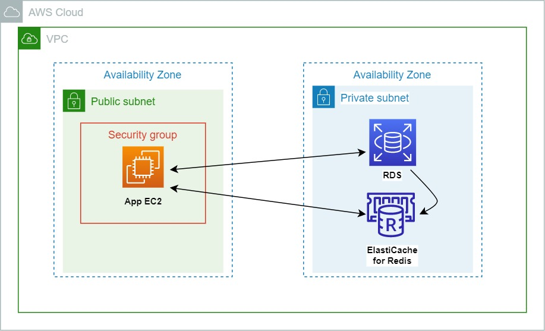
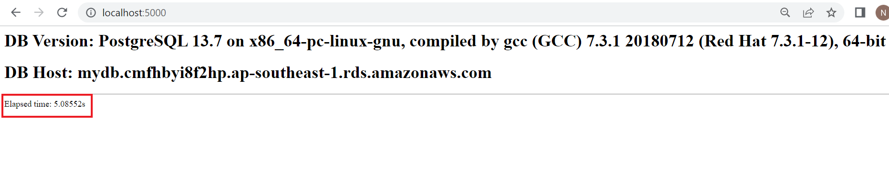
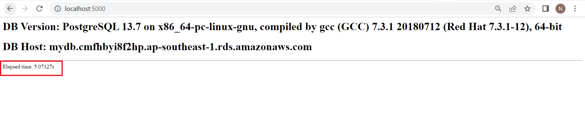
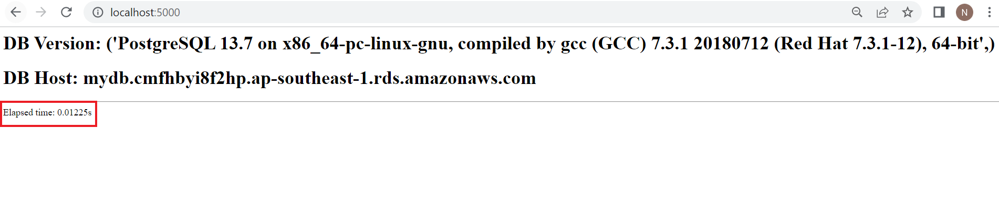

# Improve app performance using Amazon ElastiCache - A Cloud Guru Challenge

## Description

This project is a reponse to A Cloud Guru Challenge. 

The purpose of the project is to improve the performance of a dummy python application by directing the requests to ElastiCache Redis cluster instead of directly checking the RDS PostgreSQL DB. If a cache miss happens, it queries the RDS DB and loads the data to Redis. A cache hit will happen on the next time.   




**Before adding ElastiCache Redis cluster**

Before adding Redis, the app queries the RDS PostgreSQL DB and the page load time becomes high.




**After adding ElastiCache Redis cluster**

After adding Redis:

1. The app queries Redis cluster but, it can't find the data there. 
2. The request is directed to the RDS PostgreSQL DB and the data is stored in Redis for future requests.
3. The page load time is still high - the data was loaded from the RDS PostgreSQL DB.



4. When you try to reload the page, the app queries Redis cluster and a cache hit happens.
5. There's a significant change in the page load time. It became much less than before using Redis.




## Extra tasks:
1. I deployed the whole infrastructure using Terraform and used Bash scripting to configure the app EC2 instance. 
2. I used Session Manager for port forwarding to access the app page from my PC. 

## Infrastructure Deployment

### Prerequisites

1. [Terraform](https://www.terraform.io/downloads)
2. [AWS CLI](https://docs.aws.amazon.com/cli/latest/userguide/getting-started-install.html)
3. [Session Manager Plugin](https://docs.aws.amazon.com/systems-manager/latest/userguide/session-manager-working-with-install-plugin.html)

#### AWS

1. Create an IAM user with programmatic access and download the key.
2. Install AWS CLI and configure the profile using the key created in the first step and choose the region ap-southeast-1

#### Terraform

1. Update the **profile_name** in ```terraform.tfvars``` with your AWS profile name you created earlier.
2. Update the **my_ip** in ```terraform.tfvars``` with your PC IP.
3. Update the **key_name** in ```terraform.tfvars```  with the key name you created in AWS. 
4. Update the **rds_secrets_store** in ```terraform.tfvars``` with the secret name from Secrets Manager. 
5. From the root directory of the project:
    ```
    terraform init
    terraform apply
    ```
6. SSH into the EC2 instance > Go to the /root
7. Run ```python3 app-redis.py```
8. From PowerShell:

```
aws ssm start-session --profile YOUR-PROFILE-NAME --target YOUR-INSTANCE-ID --region ap-southeast-1 --document-name AWS-StartPortForwardingSessionToRemoteHost --parameters portNumber="5000",localPortNumber="5000"

```
9. Connect to the app page from your PC.


